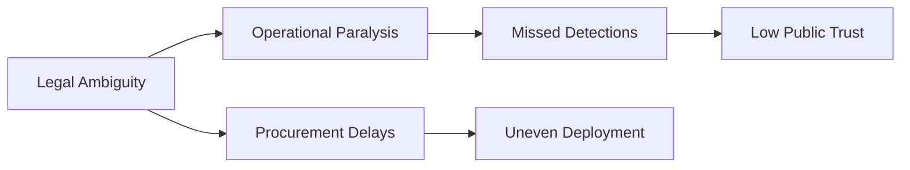

# 🇧🇪 Drone Defense – Pain Points in Belgium (Detailed v1.1)

## 🔹 Plain-Language Introduction
This document summarizes the **key pain points and systemic barriers** preventing effective drone-defense implementation in Belgium.  
It reflects findings from site operators, police, regulators, and defense agencies.  
The goal: understand what’s broken before proposing what to fix.

---

## 1️⃣  Overview Table (5W2H Mapping)

| Domain | Who | What | Where | When | Why | How | How Much |
|---------|-----|------|--------|-------|------|------|-----------|
| **Legal/Regulatory** | DGTA, BIPT, MoD | No clear legal path for active counter-drone measures | National | 2025 | Anti-jamming laws; lack of explicit C-UAS clause | Reliance on exemptions; slow permit process | High admin cost / delays |
| **Operational Coordination** | DGTA, Police, Skeyes | Fragmented authority between civil & military | Airports, Bases | Daily | No national C-UAS cell yet | Ad-hoc collaboration; unclear escalation | Risk of duplicated or missed response |
| **Technology Integration** | Site Operators, Vendors | Detection-only coverage | Airports, Events | Current | Passive-only policy | Local pilot setups; not networked | Redundant spending |
| **Procurement/Budgeting** | MoD, FPS Finance | Complex public-tender process | National | Yearly | Security urgency ≠ procurement speed | Framework contracts take 6–12 months | High opportunity cost |
| **Training/Readiness** | Police, Operators | Uneven awareness & SOPs | Nationwide | Ongoing | No central C-UAS curriculum | Local improvisation | Gaps in response time |
| **Data/Audit** | DGTA, Police | No unified evidence chain | After incidents | Ongoing | Fragmented reporting | PDF or Excel reports | Low prosecutability |

---

## 2️⃣ DQM Analysis

| Dimension | Assessment | Notes |
|------------|-------------|--------|
| **Data** | Fragmented | Different formats per agency; no shared schema |
| **Quality** | Uneven | No standard SOPs or validation process |
| **Meaning** | Obscured | No shared dashboard; poor cross-agency visibility |

---

## 3️⃣ Blueprint Alignment Check

| FIBO Stage | Manifestation | Coverage |
|-------------|---------------|-----------|
| **0 Origo** | Awareness of security gaps | ✅ |
| **1a Dualitas** | Civil–Military polarity | ✅ |
| **1b Trinitas** | Lack of containment (no single authority) | ⚠️ Missing |
| **2–3 Adaptatio/Ecologia** | Site-level improvisation | ⚠️ Weak |
| **5 Expressio** | Limited external communication | ⚠️ Weak |
| **8 Resilientia** | Learning loop absent | ❌ |
| **13 Unio** | No unified system | ❌ |

---

## 4️⃣ Key Pain Narratives (Qualitative)
1. **Legal paralysis** – Jamming/spoofing laws block even controlled tests.  
2. **Institutional limbo** – No single counter-drone command structure.  
3. **Procurement friction** – Security urgency outpaces bureaucratic tools.  
4. **Technology fragmentation** – Sensors operate as islands.  
5. **Training vacuum** – Each site invents its own playbook.  
6. **Data disconnect** – No unified national database or analytics.

---

## 5️⃣ Immediate Consequences
- Slow reaction time (5–15 min) even when detection works.
- Loss of evidence admissibility due to data-format mismatch.
- Reputational risk for airports and police.
- Financial losses due to delayed flights and event disruptions.

---

## 6️⃣ Root-Cause Map (Simplified)

---

## 7️⃣ Summary Insight
> Belgium’s drone-defense challenge is not technology scarcity — it’s **integration inertia**.  
> The system lacks a single lawful, operational, and data-coherent spine.  
> Fixing coordination and logging will unlock 80 % of the national C-UAS potential.

---

**Prepared by:** Yves Langeraert with Enigma
**Version:** v1.1 — November 2025  
**SHA-256:** a3e7a4d9f2259de8c3b9dcfb5249ffb896f18d4e1a07d0eb05c2f715b36f9cc1